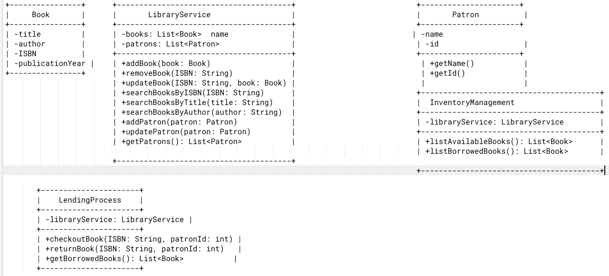

# Library Management System

## Overview

The Library Management System is a Java application designed to help librarians efficiently manage books, patrons, and lending processes. This system demonstrates the use of Object-Oriented Programming (OOP), SOLID principles, and relevant design patterns.

## Features

- **Book Management**: Add, remove, update, and search for books.
- **Patron Management**: Add and update library patrons.
- **Lending Process**: Check out and return books. Track borrowed books.
- **Inventory Management**: List available and borrowed books.

## Project Structure

The project is organized into several packages:

- **`com.library.management.model`**: Contains data model classes.
- **`com.library.management.service`**: Contains service classes and interfaces.
- **`com.library.management.process`**: Contains classes related to the lending process.
- **`com.library.management.management`**: Contains classes related to inventory management.
- **`com.library.management.main`**: Contains the main application class.

